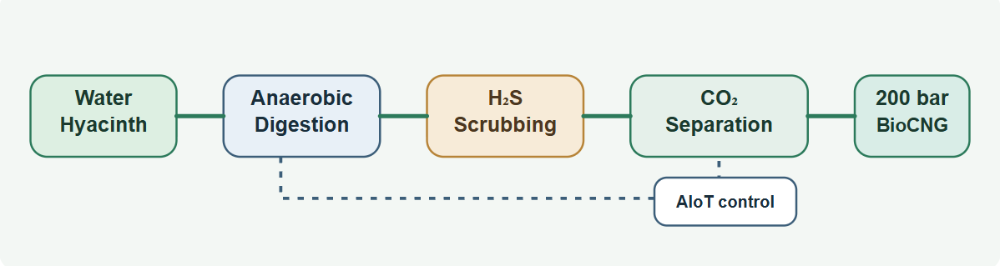

  

<h1>BioNode</h1>

<strong>AIoT BioCNG Micro-Refinery</strong>

Water hyacinth in. 200-bar BioCNG out. 
Autonomously. At the bus terminal.

  <a href="https://merry-pudding-49b37d.netlify.app/">Live demo</a>
  ·
  <a href="#overview">Overview</a>
  ·
  <a href="#architecture">Architecture</a>
  ·
  <a href="#impact">Impact</a>
  ·
  <a href="#roadmap">Roadmap</a>

## Overview

<em> BioNode is an AIoT-powered BioCNG micro-refinery designed to convert locally available biomass, especially water hyacinth, into compressed biomethane for transportation use. The concept combines feedstock handling, anaerobic digestion, gas cleaning, methane enrichment, and high-pressure compression into a compact, distributed energy system.

The system is intended for local deployment near demand centers, reducing reliance on long-distance fuel supply chains while creating a practical pathway for biomass recovery and clean transport fuel generation.</em>

## Architecture

<em>The process can be summarized as: biomass feedstock → anaerobic digestion → raw biogas → H₂S scrubbing → CO₂ separation → biomethane → high-pressure compression → 200-bar BioCNG.</em>

## Problem statement

- Bangladesh has more than 500,000 CNG vehicles and a strong dependence on imported fuel.
- Water hyacinth is a recurring environmental and economic burden in waterways across the country.
- The challenge is to connect local biomass recovery with reliable transport fuel production without building a large centralized chemical-processing system.

## Target users

- CNG fleet operators and drivers in Dhaka, Chattogram, Sylhet, and Barishal
- Urban transport and logistics operators
- Rural and peri-urban fuel demand centers
- National and regional transport systems looking for local energy resilience

## Proposed solution

BioNode is designed as a compact, site-ready fuel system with the following stages:

1. Feedstock intake using locally available water hyacinth
2. Anaerobic digestion to generate raw biogas
3. H₂S scrubbing to reduce sulfur contamination
4. CO₂ separation to target biomethane quality
5. High-pressure compression to deliver 200-bar BioCNG output

The configuration is intended to operate close to the point of demand, reducing transport losses and avoiding reliance on long-distance fuel supply chains.

## Why BioNode matters

### Key differentiators

- Edge-AI autonomy with 24/7 pH, temperature, and gas monitoring
- Zero supply chain: feedstock can be harvested from adjacent canals and waterways
- Compact, end-to-end process in a single containerized system
- Solar-water symbiosis for auxiliary power and monitoring support
- Local fuel generation for transport use near the point of demand

### Potential impact

BioNode aims to address several linked needs in one integrated platform:

- Water hyacinth management
- Local renewable fuel production
- Reduced dependence on imported fuel
- Waste-to-energy conversion
- Automated energy infrastructure
- Renewable-powered auxiliary systems
- Local energy-service opportunities

## AIoT control system

BioNode is designed around an intelligent monitoring and control layer that supports safe operation and process optimization.

Sensors → Edge controller → AI-based monitoring → Process optimization → Automated actuation → Gas quality and pressure monitoring

### Monitored parameters

- Temperature
- pH
- Biogas composition
- H₂S concentration
- CH₄ concentration
- Gas pressure
- Electrical load
- Digester conditions

## Current development status

- System architecture & AI control design: done
- Functional Edge-AI dashboard prototype: LIVE
- Component BOM (13 items): finalised
- Napkin procurement: in progress
- Dholakhali fabrication order: placed
- Phase 1 CAPEX: BDT 1,46,500 (~$1,330 USD)

## Expected impact

- 20% cheaper fuel for 500,000+ drivers
- Eliminates fuel tax burden on CNG imports
- Free waterways remediation (hyacinth removal)
- 30%+ of Bangladesh's waterways affected by hyacinth
- Potential for distributed biomass-to-fuel infrastructure at scale

## Market opportunity

- Bangladesh TAM: ~$880M/year (CNG vehicle fuel)
- BioNode EaaS target: 5% share by Year 5 = $44M ARR
- Global TAM (waste biomass markets): $2.6B by 2032
- Carbon credits: $225M-$3.5B/year at a high scale model

This is a practical infrastructure opportunity that combines waste recovery, transport fuel supply, and local energy service delivery.

## Roadmap

- Jun 2026: Prototype demo — BEAR Summit, Dhaka
- Jan 2027: 3-unit pilot live — Daily revenue: CES 2027
- 2027: 20-unit Dhaka rollout — Series A raise
- 2028: Regional deployment — Myanmar, Vietnam, Nepal, Pakistan
- 2030: 500 units — Carbon platform and integrated service model
- 2036: BioCNG infrastructure for 1 billion people

## Vision

BioNode is not a stand-alone biogas plant. It is an intelligent, distributed biomass-to-fuel infrastructure concept for converting locally available biomass into usable transportation fuel close to where it is needed.

### Clear the waterways · Produce the fuel · Power the future.

<table>
  <tr>
    <td><strong>500K+</strong> CNG vehicles in Bangladesh</td>
    <td><strong>95%</strong> Fuel import dependency</td>
    <td><strong>200 bar</strong> BioCNG output</td>
    <td><strong>≥95%</strong> CH₄ target</td>
    <td><strong>$880M</strong> Bangladesh fuel market</td>
    <td><strong>Day 1</strong> Revenue model</td>
  </tr>
</table>

<em>BioNode · Built in Bangladesh · Fuel for the world.</em>

<em><strong>BEAR Summit 2026</strong> · <em>Built for local energy, local mobility, and a cleaner operating model.</em>

---
